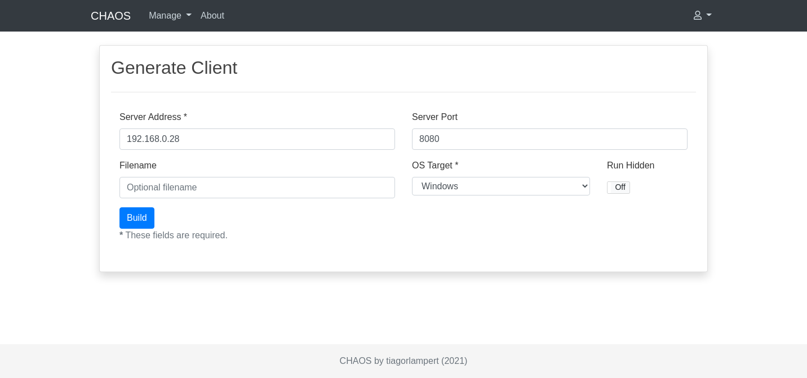
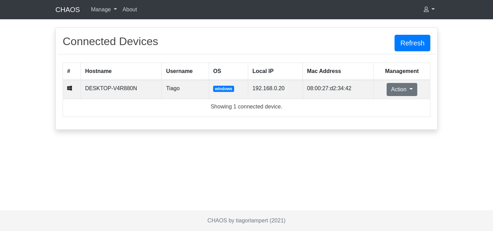
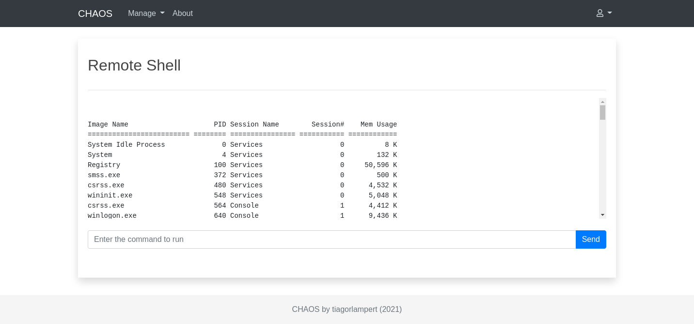
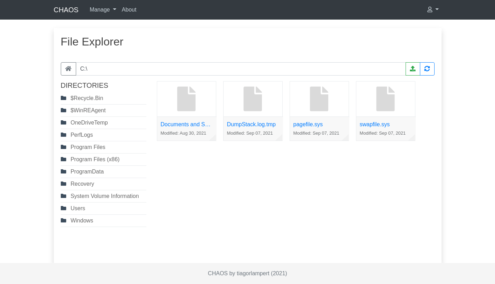

<p align="center">
  <a href="#">
    
  </a>
</p>

<h1 align="center">CHAOS: Remote Administration Tool</h1>
<p align="center">
  <a href="https://golang.org/">
    
  </a>
    <a href="https://github.com/tiagorlampert/CHAOS/releases">
    
  </a>
  <a href="https://github.com/tiagorlampert/CHAOS/blob/master/LICENSE">
    
  </a>
    <a href="https://opensource.org">
    
  </a>
</p>

<p align="center">
  CHAOS is a free and open-source Remote Administration Tool that allow generate binaries to control remote operating systems.
  <br>
  <a href="https://github.com/tiagorlampert/chaos/issues/new">Report bug</a>
  ·
  <a href="https://github.com/tiagorlampert/chaos/issues/new">Request feature</a>
  ·
  <a href="#quick-start">Quick start</a>
  ·
  <a href="#screenshots">Screenshots</a>
</p>


## Disclaimer

THIS SOFTWARE IS PROVIDED "AS IS" WITHOUT WARRANTY OF ANY KIND. YOU MAY USE THIS SOFTWARE AT YOUR OWN RISK. THE USE IS COMPLETE RESPONSIBILITY OF THE END-USER. THE DEVELOPERS ASSUME NO LIABILITY AND ARE NOT RESPONSIBLE FOR ANY MISUSE OR DAMAGE CAUSED BY THIS PROGRAM.


## Table of contents

- [Features](#features)
- [Quick start](#quick-start)
- [Screenshots](#screenshots)
- [Contributing](#contributing)
- [Donate](#donate)
- [Sponsors](#sponsors)
- [Copyright and license](#copyright-and-license)

## Features

| Feature                  |     |   |
|:-------------------------|:-------:|:------:|
| `Reverse Shell`          |    X    |    X   |
| `Download File`          |    X    |    X   |
| `Upload File`            |    X    |    X   |
| `Screenshot`             |    X    |    X   |
| `File Explorer`          |    X    |    X   |
| `Get OS Info`            |    X    |    X   |
| `Run Hidden`             |    X    |        |
| `Restart`                |    X    |    X   |
| `Shutdown`               |    X    |    X   |

## Quick start

Some install options are available:

### 1. Docker
```bash
# Create a shared directory between the host and container
$ mkdir ~/chaos-container

$ docker run -it -v ~/chaos-container:/database/ -v ~/chaos-container:/temp/ \
  -e PORT=8080 -p 8080:8080 tiagorlampert/chaos:v5.0.0
```

### 2. Local Development
```bash
# Install dependencies
$ sudo apt install golang git -y

# Get this repository
$ git clone https://github.com/tiagorlampert/CHAOS

# Go into the repository
$ cd CHAOS/

# Run
$ PORT=8080 DATABASE_NAME=chaos go run cmd/chaos/main.go
```

After running go to http://localhost:8080 and login with the default username: ***admin*** and password: ***chaos***.

## Screenshots








## Contributing
See our contributing guide at [CONTRIBUTING.md](../master/CONTRIBUTING.md).

## Donate
If you enjoyed this project, give me a cup of coffee. :)

[](https://www.paypal.com/cgi-bin/webscr?cmd=_donations&business=SG83FSKPKCRJ6&currency_code=USD&source=url)

## Sponsors
 Sponsored by [JetBrains Open Source License](https://www.jetbrains.com/buy/opensource/).

## Copyright and license

>The [MIT License](https://github.com/tiagorlampert/CHAOS/blob/master/LICENSE)
>
>Copyright (c) 2017, Tiago Rodrigo Lampert
>
